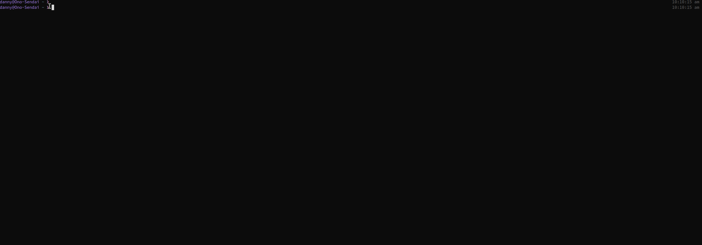

# Engage Jr

A set of shell scripts for spinning up a new engagement workspace. Run one command with a job name and a hosts file and it builds a directory structure, normalises the host list into multiple formats, creates a Burp project file, and drops you into a shell at the engagement root ready to start testing.

Built by Daniel Roberts. Enhanced with AI assistance to improve functionality.

## Scripts

| Script | Description |
|---|---|
| `engage_jr` | Entry point. Run this to start a new engagement |
| `dir_build` | Builds the directory structure for a given engagement type |
| `clean_hosts` | Normalises a hosts file into multiple formats |
| `burper` | Creates a Burp Suite project file for the engagement |

## Setup

Clone the repo and edit `config` to match your environment before first use:

```
ENGAGEJR_BASE_DIR=/Share
ENGAGEJR_BURP_JAR=~/BurpSuitePro/burpsuite_pro.jar
ENGAGEJR_BURP_WAIT=60
```

The config file lives alongside the scripts so the tool is portable across machines — clone and edit, no install step needed.

## Usage

**Start a new engagement:**
```
engage_jr <job_name> <hosts_file>
```

Creates the engagement directory under `$ENGAGEJR_BASE_DIR/work/`, processes the hosts file, creates a Burp project, and drops into a shell at the engagement root.

**List existing engagements:**
```
engage_jr -l [category]
```

**Build a directory for other lab types directly:**
```
source dir_build -w <name>    # work engagement
source dir_build -t <name>    # TryHackMe
source dir_build -b <name>    # HackTheBox
source dir_build -e <name>    # exam
source dir_build -p <name>    # PortSwigger
```

## Host Files

`clean_hosts` produces three output files from your input hosts list:

| File | Contents | Use case |
|---|---|---|
| `hosts` | All IPs and bare hostnames | Tools that do not accept `http://` |
| `nohttp_hosts` | Stripped hostnames from HTTP targets only | Hostname-only tool input |
| `http_hosts` | Original URLs with scheme | Tools that require `https://` |

Input supports single IPs, ranges (`10.10.10.1-5`), CIDR notation (`10.10.10.0/24`), and `http://` / `https://` URLs. Output is sorted and deduplicated.

## Example


